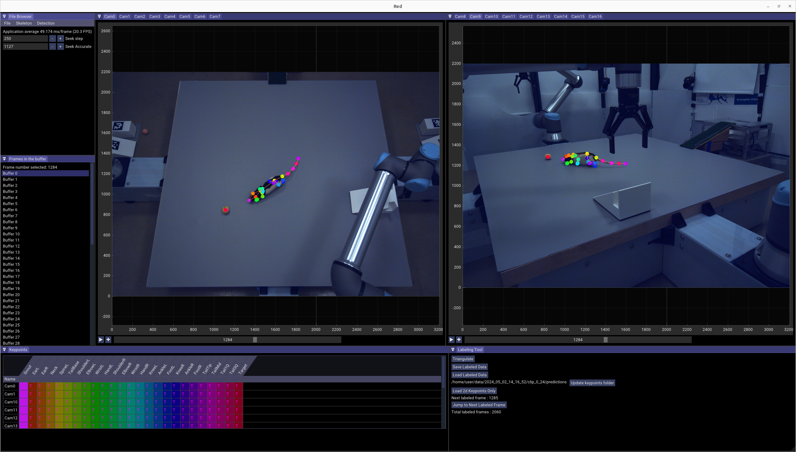

# Red Labeling App
3D labeling tool for multiple cameras in C++

Contact [Jinyao Yan](yanj11@janelia.hhmi.org) if you have questions about the software 



## Video demo
Please see this [link](https://www.youtube.com/watch?v=9eOJaadE1Nc) for a video demo of the app. 

## Features
1. Real-time GPU accelerated decoding (h264, h265)
2. Synchronized decoding
3. Multi-view keypoints labeling and triangulation  
4. YOLOv5 (OpenCV cuDNN ONNX model) and YOLOv8 (TensoRT) inference  

## Dependencies
1. NVIDIA Video Codec SDK
1. CUDA Toolkit and cuDNN
2. FFmpeg 
3. OpenCV
4. TensorRT
5. OpenGL

## CMake Presets

The repo now includes shared CMake presets for named dependency stacks in
[CMakePresets.json](/home/delahantyj@hhmi.org/gitrepos/crimson/CMakePresets.json).

Current preset stack family:

- `linux-trt10-cuda12.4-release`
- `linux-trt10-cuda12.4-debug`
- `windows-trt10-cuda12.4`
- `windows-trt10-cuda12.4-no-sfm`
- `macos-arm64-release`

Those presets currently mean:

- CUDA `12.4`
- OpenCV `4.10.0`
- TensorRT `10.0.1.6`

The preset name describes the expected dependency versions. Configure will now
fail if the discovered CUDA, OpenCV, or TensorRT version does not match that
stack. For support status and which stacks are baseline vs planned vs
experimental, see
[docs/crimson_supported_dependency_stack_matrix.md](/home/delahantyj@hhmi.org/gitrepos/crimson/docs/crimson_supported_dependency_stack_matrix.md).
For the promotion process that moves stacks between those labels, see
[docs/crimson_dependency_stack_promotion_process.md](/home/delahantyj@hhmi.org/gitrepos/crimson/docs/crimson_dependency_stack_promotion_process.md).
For the first Windows validation record, see
[docs/crimson_windows_trt10_cuda12.4_validation_record.md](/home/delahantyj@hhmi.org/gitrepos/crimson/docs/crimson_windows_trt10_cuda12.4_validation_record.md).
For a step-by-step Windows laptop bring-up guide, see
[docs/crimson_windows_first_validation_guide.md](/home/delahantyj@hhmi.org/gitrepos/crimson/docs/crimson_windows_first_validation_guide.md).
For the recommended recording-root layout and Windows launch examples, see
[docs/crimson_recording_folder_layout.md](/home/delahantyj@hhmi.org/gitrepos/crimson/docs/crimson_recording_folder_layout.md).

If you are confused by `nvidia-smi` showing a different CUDA version than
`nvcc` or the preset name, see
[docs/crimson_cuda_driver_toolkit_and_presets.md](/home/delahantyj@hhmi.org/gitrepos/crimson/docs/crimson_cuda_driver_toolkit_and_presets.md).

For a first Windows bring-up where 3D triangulation is not needed, prefer
`windows-trt10-cuda12.4-no-sfm`. That preset disables the OpenCV SFM-based
triangulation path and leaves the rest of the pinned stack unchanged.

### macOS Phase 1 Shell

`macos-arm64-release` builds the provisional native Apple Silicon application
shell with GLFW/Cocoa, ImGui, ImPlot, and Metal. It intentionally excludes
CUDA, NVDEC, TensorRT, GLEW, OpenGL, FFmpeg, OpenCV, HDF5, and production
Crimson runtime sources. It is a build/backend skeleton, not a session viewer
or feature-parity release.

Prerequisites and build:

```bash
brew install cmake ninja glfw
git submodule update --init --recursive
cmake --preset macos-arm64-release
cmake --build --preset build-macos-arm64-release
ctest --preset test-macos-arm64-headless
ctest --preset test-macos-arm64
```

The app bundle is written to
`build/macos-arm64-release/Crimson.app`. Keeping it inside the preset build
directory prevents another configuration from replacing the executable used by
CTest. The CTest suite contains a headless offscreen Metal/ImGui pixel test and
a finite real-window GLFW/Cocoa presentation smoke. See
[`docs/crimson_macos_phase0_inventory.md`](docs/crimson_macos_phase0_inventory.md)
for the baseline, parity inventory, measured results, and NVIDIA validation
commands.

### How Dependency Paths Are Supplied

Shared presets in the repo define the supported stack.

Machine-local paths should come from either:

- environment variables
- a local `CMakeUserPresets.json`

The shared presets read these environment variables:

- `CRIMSON_CUDA_TOOLKIT_ROOT`
- `CRIMSON_OPENCV_DIR`
- `CRIMSON_FFMPEG_ROOT`
- `CRIMSON_VIDEO_CODEC_SDK_ROOT`
- `CRIMSON_TENSORRT_ROOT`

Notes:

- `CRIMSON_OPENCV_DIR` should point to the directory containing
  `OpenCVConfig.cmake`
- `CRIMSON_FFMPEG_ROOT` and `CRIMSON_TENSORRT_ROOT` should point to install
  roots
- `CRIMSON_VIDEO_CODEC_SDK_ROOT` should point to the NVIDIA Video Codec SDK
  root, typically the folder containing `Interface/` and either `Lib/x64/`
  or `Lib/win/x64/`
- normal GUI playback requires NVDEC/CUVID (`nvcuvid`) but not NVENC
  (`nvencodeapi`). Set `-DCRIMSON_ENABLE_NVENC=ON` only for future
  encode/export targets that actually use NVIDIA's encode API.

Linux example:

```bash
export CRIMSON_CUDA_TOOLKIT_ROOT=/usr/local/cuda-12.4
export CRIMSON_OPENCV_DIR=/opt/crimson/lib/opencv/lib/cmake/opencv4
export CRIMSON_FFMPEG_ROOT=/opt/orange/lib/ffmpeg-nvidia
export CRIMSON_VIDEO_CODEC_SDK_ROOT=/opt/nvidia/Video_Codec_SDK
export CRIMSON_TENSORRT_ROOT=/usr/local/TensorRT-10.0.1.6

cmake --preset linux-trt10-cuda12.4-release
cmake --build --preset build-linux-trt10-cuda12.4-release
```

Windows example:

```powershell
$env:CRIMSON_CUDA_TOOLKIT_ROOT="C:/Program Files/NVIDIA GPU Computing Toolkit/CUDA/v12.4"
$env:CRIMSON_OPENCV_DIR="C:/third_party/opencv-install-4.10.0-x64"
$env:CRIMSON_FFMPEG_ROOT="C:/third_party/ffmpeg-nvidia"
$env:CRIMSON_VIDEO_CODEC_SDK_ROOT="C:/third_party/Video_Codec_SDK_13.0"
$env:CRIMSON_TENSORRT_ROOT="C:/third_party/TensorRT-10.0.1.6"

cmake --preset windows-trt10-cuda12.4
cmake --build --preset build-windows-trt10-cuda12.4-release
```

If you do not need triangulation or other SFM-backed 3D labeling helpers on
Windows yet, use:

```powershell
cmake --preset windows-trt10-cuda12.4-no-sfm
cmake --build --preset build-windows-trt10-cuda12.4-no-sfm-release
```

Run the Windows preset from a Visual Studio developer shell or another shell
that already has the MSVC toolchain available.

For repeat use on the validated Windows stack, prefer the helper script:

```powershell
. .\tools\set_windows_dependency_roots.ps1
```

If PowerShell reports that running scripts is disabled, allow scripts for only
the current shell and rerun the helper:

```powershell
Set-ExecutionPolicy -Scope Process -ExecutionPolicy Bypass
. .\tools\set_windows_dependency_roots.ps1
```

For a persistent per-user setting, use:

```powershell
Set-ExecutionPolicy -Scope CurrentUser -ExecutionPolicy RemoteSigned
```

It sets the `CRIMSON_*` dependency roots and prepends the common runtime DLL
directories to `PATH` for the current PowerShell session.

### Local User Presets

If you do not want to export environment variables every time, create a local
`CMakeUserPresets.json`. This file is ignored by git.

Example:

```json
{
  "version": 3,
  "configurePresets": [
    {
      "name": "local-linux-trt10",
      "inherits": "linux-trt10-cuda12.4-release",
      "cacheVariables": {
        "CUDA_TOOLKIT_ROOT_DIR": "/usr/local/cuda-12.4",
        "OpenCV_DIR": "/opt/crimson/lib/opencv/lib/cmake/opencv4",
        "FFMPEG_ROOT": "/opt/orange/lib/ffmpeg-nvidia",
        "TENSORRT_ROOT": "/usr/local/TensorRT-10.0.1.6"
      }
    }
  ]
}
```

Then run:

```bash
cmake --preset local-linux-trt10
cmake --build build/local-linux-trt10
```

## Build instructions 

### Install cuDNN (depends on CUDA installation)
- download the cudnn install files (we use `cudnn 8.9.3` with `driver 525.105.17` and `cuda 12.0` )
- you may run the commands below for the exact version or download a TAR file for `cudnn-linux-x86_64-8.9.3.28_cuda12-archive.tar.xz` from the [cudnn version archives](https://developer.nvidia.com/rdp/cudnn-archive)
- extract the file
- copy cudnn files to where your `cuda` is installed -- we assume it is installed at `/usr/local/cuda` 
  ```
  sudo cp cudnn-*-archive/include/cudnn*.h /usr/local/cuda/include 
  sudo cp -P cudnn-*-archive/lib/libcudnn* /usr/local/cuda/lib64 
  sudo chmod a+r /usr/local/cuda/include/cudnn*.h /usr/local/cuda/lib64/libcudnn*
  ```
- verify installation and cudnn version
  ```
  source ~/.bashrc
  cat /usr/local/cuda/include/cudnn_version.h | grep CUDNN_MAJOR -A 2
  ```
  you can expect an output like:
  ```
  #define CUDNN_MAJOR 8
  #define CUDNN_MINOR 9
  #define CUDNN_PATCHLEVEL 3
  --
  #define CUDNN_VERSION (CUDNN_MAJOR * 1000 + CUDNN_MINOR * 100 + CUDNN_PATCHLEVEL)
  ```

### Install OpenCV
- download and upzip `opencv-4.8.0.zip` and `opencv_contrib-4.8.0.zip`. Unzip the folders to `~/build/`, for instance. Note, if you are using cuda 12.2, please download opencv-4.10 instead.

- to build OpenCV with opencv sfm, please follow instructions from: https://docs.opencv.org/4.x/db/db8/tutorial_sfm_installation.html first to install sfm dependency. Ceres solver is optional. If you wish to install ceres solver, a more detailed installation instruction can be found at: http://ceres-solver.org/installation.html#linux. At the time of test, one need to set CMake flag USE_CUDA=OFF for ceres.  

- build OpenCV using

```
cd opencv-4.8.0/ 
mkdir build
cd build 
```

```
cmake -D CMAKE_BUILD_TYPE=RELEASE \
-D CMAKE_INSTALL_PREFIX=/usr/local \
-D WITH_TBB=ON \
-D ENABLE_FAST_MATH=1 \
-D CUDA_FAST_MATH=1 \
-D WITH_CUBLAS=1 \
-D WITH_CUDA=ON \
-D BUILD_opencv_cudacodec=OFF \
-D WITH_CUDNN=ON \
-D OPENCV_DNN_CUDA=ON \
-D CUDA_ARCH_BIN=7.5 \
-D WITH_V4L=ON \
-D WITH_QT=ON \
-D WITH_OPENGL=ON \
-D WITH_GSTREAMER=ON \
-D OPENCV_GENERATE_PKGCONFIG=ON \
-D OPENCV_PC_FILE_NAME=opencv.pc \
-D OPENCV_ENABLE_NONFREE=ON \
-D OPENCV_EXTRA_MODULES_PATH=~/build/opencv_contrib-4.8.0/modules \
-D INSTALL_PYTHON_EXAMPLES=OFF \
-D INSTALL_C_EXAMPLES=ON \
-D BUILD_EXAMPLES=ON ..
```

```
make -j $(nproc) 
sudo make install
```
### Install TensorRT
- [tensor-rt (depends on nvidia-driver and CUDA)](#install-tensor-rt)

### install tensor-rt
this is based on [these instructions](https://docs.nvidia.com/deeplearning/tensorrt/install-guide/index.html#installing-tar) (has more details if needed)

**0. download and extract tensor-rt installation file**
  - we use `TensorRT-8.6.1.6` with `cuda 12.0`  -- you can directly download this (or from this page). But if you are using `cuda 12.2` and above, please use TensorRT 10, for instance `TensorRT-10.6.0.26.Linux.x86_64-gnu.cuda-12.6`. The installation steps are similar.
    ```
    cd /home/$USER/nvidia
    wget https://developer.nvidia.com/downloads/compute/machine-learning/tensorrt/secure/8.6.1/tars/TensorRT-8.6.1.6.Linux.x86_64-gnu.cuda-12.0.tar.gz
    tar -xzvf TensorRT-8.6.1.6.Linux.x86_64-gnu.cuda-12.0.tar.gz
    ```
  - this should extract a folder `TensorRT-8.6.1.6` with following subdirectories
    ```
    bin  data  doc  include  lib  python  samples  targets
    ```
  - rename the folder `TensorRT`.

**1. add tensor-rt path in bashrc**
  - Add the absolute path to the TensorRT lib directory to the environment variable `LD_LIBRARY_PATH`:
    ```
    export LD_LIBRARY_PATH=/home/$USER/nvidia/TensorRT/lib:$LD_LIBRARY_PATH 
    source ~/.bashrc
    ```
**2. verify installation**
  - try to build one of the sample programs (say, `trtexec`) to verify installation
    ```
    cd /home/$USER/nvidia/TensorRT/samples/trtexec
    make
    ```
  - run the program built above
    ```
    cd home/$USER/nvidia/TensorRT/bin/
    ./trtexec
    ```


### Install RED 

- Clone the repo and submodules

```
git clone --recursive https://github.com/JohnsonLabJanelia/red.git
```

If you are building the project for the first time, uncomment [`line 16 ~ line 26`](https://github.com/JohnsonLabJanelia/red/blob/0829b09d20b0dbccb0ea6df7a20e5ee4e23f635f/build_linux.sh#L16) for building `ImGui` and `ImPlot` object files. Run
```
./build.sh
```
Comment out Line 16 ~ line 26 to reduce compiling time afterwards. 

Once built, it will make a folder called `release`. The executable `redgui` is the application. Start the program using the run script. 

```
./run.sh
```

## UI Path Presets

`redgui` can load file-browser start paths and quick presets from:

- `config/ui_paths.json` (repo-local, default)
- `~/.config/crimson/ui_paths.json`
- `CRIMSON_UI_PATHS_CONFIG` (explicit override)

Example:

```json
{
  "default_start_path": "/nvme1",
  "preferred_roots": [
    "/nvme1"
  ]
}
```

The configured `preferred_roots` appear in the app under `File -> Path Preset`.

## Format data for Deep Learning
Currently we are saving labeled keypoints simply as a plain csv file. We provide python scripts for formating data as [COCO format](https://docs.aws.amazon.com/rekognition/latest/customlabels-dg/md-coco-overview.html), which is used by [JARVIS](https://github.com/JARVIS-MoCap/JARVIS-HybridNet). Please refer to [data_exporter](https://github.com/JohnsonLabJanelia/red/tree/main/data_exporter).

## Contribute

Please open an issue for bug fix or feature request. If you wish to make changes to the source code, you can fork the repo. To contribute to the project, please create a [pull request](https://docs.github.com/en/pull-requests/collaborating-with-pull-requests/proposing-changes-to-your-work-with-pull-requests/creating-a-pull-request).
